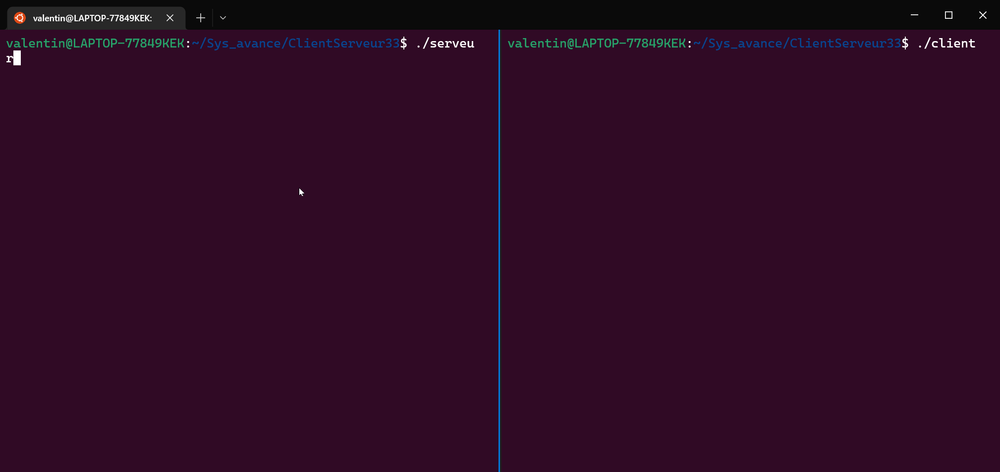

# ClientServeur

## Description

Ce projet est un projet de programmation réseau en C. Il s'agit de créer un serveur et un client qui communiquent entre eux en utilisant les sockets.

Il y a deux versions du projet : 
 - Une version qui utilise les sockets avec un flux TCP. Le serveur envoie un captcha au client, qui doit le résoudre pour se connecter.

 - Une version qui utilise les sockets avec un flux UDP. Le client peut envoyer un message au serveur, qui l'affiche sur son terminal.

## Quelques exemples d'utilisation

#### Authentification avec un code

#### Communication avec un serveur

#### Service de plagiat (en UDP)

Pour calculer le pourcentage de plagiat entre deux fichiers, on calcule la [distance de Levenshtein](https://fr.wikipedia.org/wiki/Distance_de_Levenshtein#:~:text=La%20distance%20de%20Levenshtein%20est,une%20cha%C3%AEne%20%C3%A0%20l'autre.) entre les deux fichiers. 

